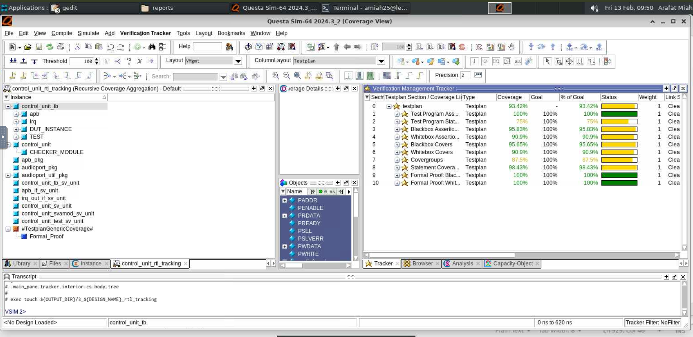
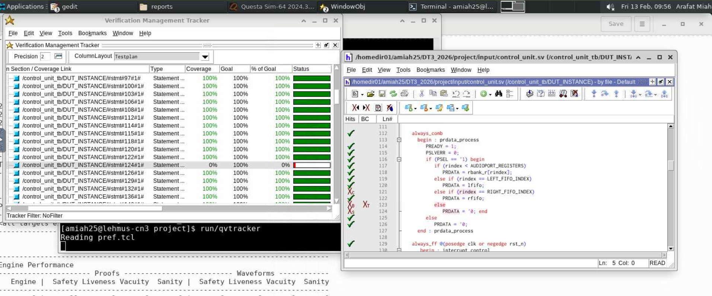
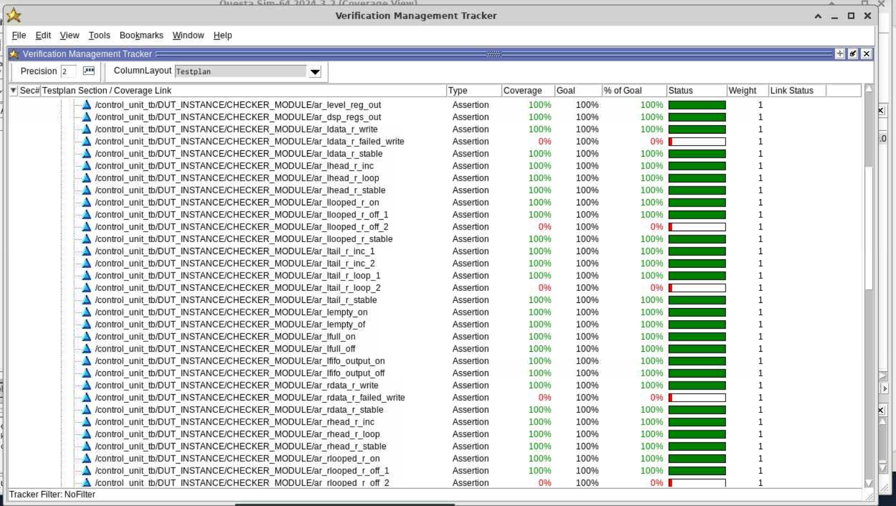

# Week 5: Control Unit RTL Verification, Formal Proofs & Coverage Analysis

## 📖 What is this week about?
The primary objective of Week 5 was to rigorously verify the Register-Transfer Level (RTL) design of the `control_unit`. Moving past basic functional simulation, this week focused on advanced, industry-standard verification methodologies to mathematically and dynamically prove the robustness of the design.

The core tasks involved implementing coverage-driven verification (Code and Functional Coverage), executing mathematical Formal Verification (PropertyCheck), analyzing testbench quality using Mutation Analysis (Certitude), and running a preliminary Synthesizability Check using Synopsys Design Compiler to ensure physical viability.

## 🛠️ What I Created
To achieve high-confidence verification, I executed a multi-tool EDA workflow:

* **Coverage-Driven Verification**: Integrated custom Covergroups (`cg_rbwrites`, `cg_commands`) to explicitly track how thoroughly the testbench exercises the register bank and APB command interfaces during dynamic RTL simulation.
* **Formal Verification (Questa PropCheck)**: Utilized formal mathematical proofs to definitively verify 155 black-box and white-box assertions, ensuring no edge cases violate the design specifications.
* **Functional Qualification (Synopsys Certitude)**: Performed automated mutation analysis (injecting artificial bugs into the RTL) to evaluate if the testbench could successfully catch undetected hardware faults.
* **Synthesizability Check (Design Compiler)**: Compiled the RTL into gate-level logic to verify that the design is physically realizable, checking flip-flop counts and setup slacks.

## 📊 Results, Numeric Data & Proof of Concept
The control unit was verified using Siemens QuestaSim, Questa Formal, Synopsys Certitude, and Synopsys Design Compiler. The results below prove the functional correctness and structural integrity of the design.

### 1. Functional Simulation & Coverage Results
The directed testbench passed 10/10 functional simulations with 0 failures. Coverage analysis revealed high statement execution, while identifying specific corner-case gaps for future test enhancement.

| Coverage Metric | Achieved Value | Analysis |
| :--- | :--- | :--- |
| **Statement Coverage** | **96.70%** | Excellent. Only 3 out of 91 statements were missed (rare branch conditions). |
| **Directive Coverage** | **71.42%** | Moderate. Uncovered directives relate to unexercised FIFO full/wrap-around states. |
| **Covergroup: `cg_rbwrites`** | **100.00%** | All targeted register bank writes were fully exercised. |
| **Covergroup: `cg_commands`** | **83.33%** | Majority of APB commands successfully verified. |

*Figure 1: QuestaSim Verification Management Tracker showing the overall testplan coverage aggregation.*

*Figure 2: Detailed code coverage analysis identifying a 0% statement coverage hole caused by an unexercised invalid register access path.*

### 2. Formal Verification Results (Questa PropCheck)
Formal verification successfully proved the mathematical integrity of the control unit's logic. No assertions fired (failed), meaning the design is structurally sound against all tested assumptions.

| Formal Metric | Count | Status |
| :--- | :--- | :--- |
| **Assertions Proven** | **155** | 100% SUCCEEDED |
| **Assertions Fired (Failed)** | **0** | NO BUGS FOUND |
| **Covers Proven** | **109** | 100% REACHED |

*Figure 3: Formal Verification tracker demonstrating 100% coverage across the majority of white-box assertions, proving internal state transitions function correctly.*

### 3. Functional Qualification / Mutation Analysis (Certitude)
Artificial faults were injected to test the testbench's bug-catching ability. The environment demonstrated strong verification quality by detecting the vast majority of injected faults.

| Fault Class | Count | Description |
| :--- | :--- | :--- |
| **Detected** | **165** | Testbench successfully caught the injected bug. |
| **Non-Activated (NA)** | 5 | Faulty logic was never triggered by the current testcases. |
| **Non-Propagated (NP)** | 6 | Bug was triggered, but the error didn't reach an output pin. |
| **Non-Detected (ND)** | 2 | Bug reached the output, but no assertion flagged it. |

### 4. Synthesizability Check (Design Compiler)
The RTL code was compiled into gate-level logic to verify that it meets real-world physical design constraints without generating timing loops or unwanted latches.

| Synthesis Property | Value | Status |
| :--- | :--- | :--- |
| **Number of Flip-Flops** | 5,981 | Matches architectural expectations exactly. |
| **Worst Reg-to-Reg Setup Slack** | **+8.85 ns** | **MET.** Comfortably passes timing constraints. |
| **Critical Warnings** | 0 | No timing loops or unintended latches generated. |

## 📂 Repository Files
*(Note: Raw images and documents are included for deep technical review).*

* `control_unit_coverage_summary.png` - QuestaSim verification tracker overview.
* `control_unit_statement_coverage_hole.png` - Source code analysis of missed coverage statements.
* `control_unit_whitebox_coverage.png` - White-box assertion tracking results.

## 🧠 What I Learned This Week
* **The Difference Between Code and Functional Coverage:** I learned that hitting 100% statement coverage does not mean a design is bug-free. Functional coverage (using Covergroups) is critical to prove that specific feature combinations and corner cases were actually tested.
* **Formal Verification Power:** I discovered how formal tools use mathematical proofs to evaluate millions of potential states simultaneously, replacing the need for exhaustive, manually written simulation vectors.
* **Testbench Quality Control:** Using Synopsys Certitude taught me the concept of mutation analysis. Injecting artificial bugs proved that a testbench is only as good as its assertions—if a bug propagates to the output but isn't flagged by a checker, the testbench needs improvement.
* **Systematic Debugging:** Resolving coverage holes and assertion failures required me to deeply analyze the interaction between RTL logic and APB bus protocols, significantly sharpening my debugging and structural design skills.

## Disclaimer
This repository contains **only a portion of the full laboratory project** and is shared **solely for demonstration and portfolio purposes**.
It is **not intended to be used as a solution reference** for academic coursework or assessments. Any reuse should be for learning or professional evaluation only.

---

## Author
**Arafat Miah,**  
Master of Science Student, Electronics  
University of Oulu
